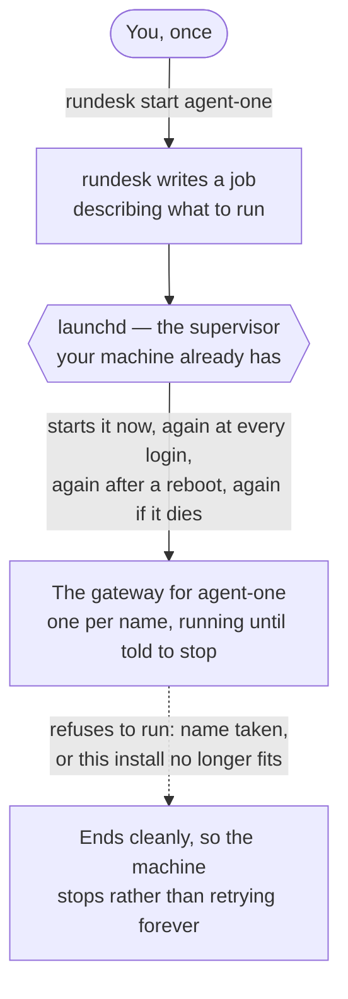
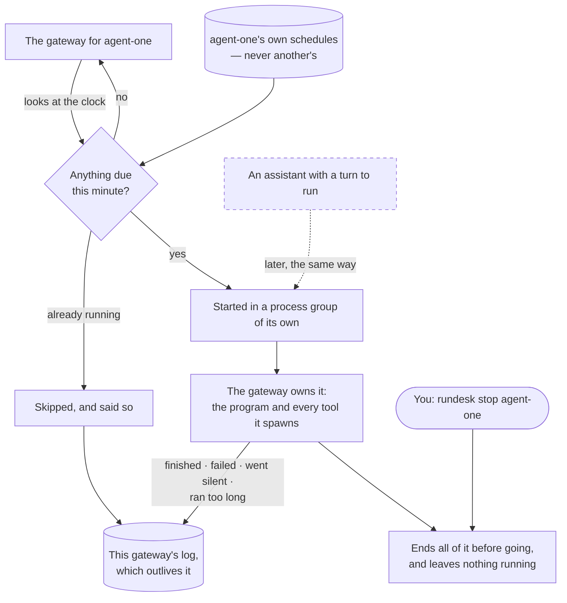
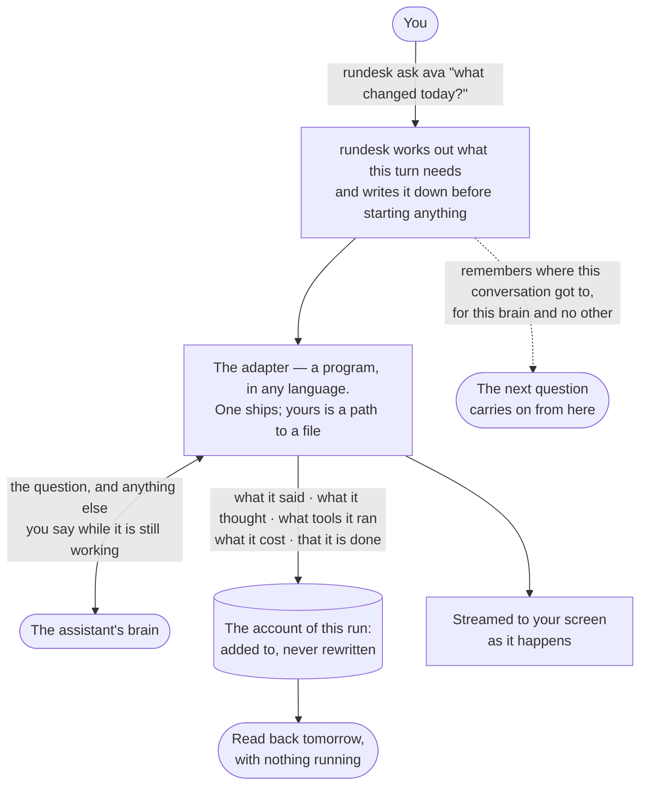
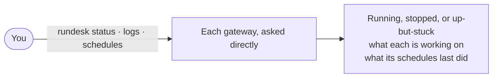
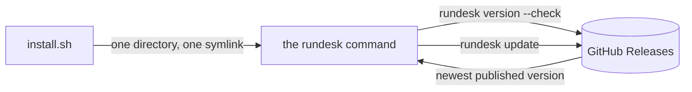
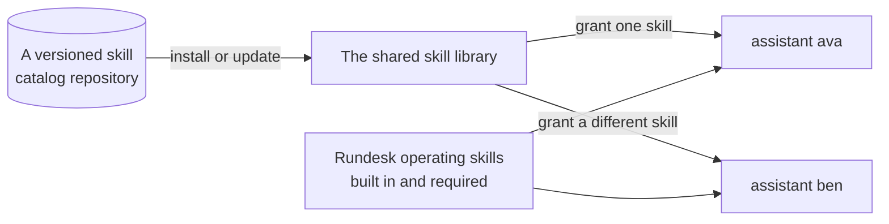

# Overview — rundesk-cli

*The platform in plain language — written for product, marketing and anyone new, not for developers. What
the parts are and how something moves through them. Follow a link to learn what a part guarantees.*

*This describes the platform as designed. What is proven today is recorded row by row in the contracts —
[`prd/`](./prd/) for the ratified ones, [`prd-drafts/`](./prd-drafts/) for those still in proposal.*

## What this is

`rundesk` is the command a person uses to run a small team of AI assistants on their own computer and
reach them from a chat app. Today it puts itself on your machine and keeps itself current, runs the
long-lived process an assistant works inside, and **reaches an assistant's brain and gets an answer
back** — you can ask one a question and read what it did afterwards. What is not here yet is the chat
apps: reaching an assistant from somewhere other than your own terminal. It is a self-hosted tool, not
something sold; there is no revenue model.

## The platform

**Handing one over, once.** You do this a single time per assistant; from then on the machine keeps it
running and you only ever ask it questions.

**What it then does, unattended.** This is the loop that runs without you, and the ownership that makes
stopping safe.

**Asking an assistant something.** The brain is a *program rundesk runs*, not code inside rundesk — which
is what lets you put your own behind an assistant, and why one rundesk has never heard of works exactly
like one that ships with it.

**Asking it what is happening.** `status` and `logs` ask the gateways themselves rather than the
supervisor — which is how they can show a gateway that is up but stuck, something launchd cannot tell you.

**Keeping this copy current.** Separate from all of the above: it is about the command itself, not what
it runs.

**Adding maintained skills.** A catalog repository is installed and updated as one collection, while
each assistant still receives only the skills its owner grants. Rundesk's own operating skills remain
part of every assistant's baseline and cannot be removed.

## How it works

- **rundesk** — the one command, and the whole surface. Every verb the finished product will have is
  listed from the start, so what is coming is never a surprise.
- **Version** — which release this install is, and whether a newer one exists.
- **Update** — fetches the newest published release and lays it over the install, leaving the command on
  your PATH working. It stands your assistants down first and brings them back afterwards, and refuses
  outright rather than interrupting one that is mid-task.
- **Install / uninstall** — puts the command on your PATH, or removes it. It refuses to report success
  until the command it installed actually answers.
- **Skill catalogs** — versioned repositories of complete skill packages. Installing one makes all of
  its skills available without granting them; the repository is updated or removed as one unit, and
  every installed catalog keeps its source and declared version.
- **A gateway** — the part that stays running. There is one for each name, so later there can be one for
  each assistant, and any one of them can be restarted without disturbing the rest.
- **Your machine keeps it up** — rundesk supervises nothing itself. It writes down what to run and hands
  that to the thing your computer already has for keeping programs running, which brings a gateway back
  if it falls over and starts it again after a restart.
- **The programs a gateway runs** — later, the assistants' own tools. A gateway owns everything it starts:
  it ends all of it when it goes, never runs the same piece of work twice at once, and ends work an
  earlier gateway left behind.
- **Talking to a program while it runs** — a gateway does not only watch a program, it holds a conversation
  with one: sending it something and taking its answers a whole piece at a time, as they come.
- **Schedules** — work that starts itself, because the time came: you state a time in the ordinary way and
  what to run, and the gateway starts it and owns it like anything else. Each gateway has its own set, so
  later each assistant's schedules are its own and never another's to run. You can turn one off and keep
  it, rather than deleting it to stop it.
- **Status and logs** — what is running, what each one is working on, which version each is on, and what
  it has been saying. One that is up but stuck is shown as stuck, which the machine cannot tell you.
- **An assistant's brain** — reached through a seam that is a *program rundesk runs*, never code loaded
  inside it. One ships; anything else you point it at works the same way, in any language, and rundesk
  keeps no list of which brains exist. Each says for itself what it can do — run tools, carry a
  conversation on, say what a turn cost, take a word mid-turn — and one that can do none of those is a
  whole assistant with that work simply absent.
- **Asking one something** — one question, one answer, streamed to your screen as it happens. Ask again
  and it carries on where it left off; say more while it is still working and it takes that in without
  being stopped and started again.
- **The account of a run** — what an assistant did, written while it does it and never rewritten, so a
  night's work can be read back in the morning with nothing running. Beside it, word for word, is
  everything the brain itself said — kept separately, so it can be thrown away later without taking the
  account with it.
- **Handing heavy work to a specialist** — an assistant can pass one bounded job to a *role*: a
  shared specialist definition, run as a fresh isolated execution that carries none of the
  assistant's identity, memory, history or operating rules. It works in the project you named, so
  that project's own instructions apply to it normally, and it is given exactly the skills the
  role lists. The assistant acknowledges and gets on with other things; when the specialist is
  finished, the assistant is woken to read the one report it produced, check it, and answer you
  itself. Nothing the specialist wrote reaches you unreviewed, and a specialist cannot hand work on
  to another one.
- **What it cost** — in tokens, as the brain reported them. A run whose cost never arrived says so rather
  than claiming it cost nothing.
- **Channels, runs, usage** — reaching an assistant from a chat app, and listing what it has done.
  Registered and answering "coming soon" until each is built.
- **GitHub Releases** — where a published version comes from.

## What you use

- **The owner** — installs the command, checks what version they are on, and updates when there is a
  newer one. Nobody else touches this: it runs on one person's machine, for that person.

## What governs it

- **Nothing to install first** — the standard library is the whole toolbox, so a machine with `python3`
  has everything. A dependency would be a user lost at the first step.
- **A command never claims a success it did not earn** — a verb that is planned and not built says so and
  exits non-zero, because a script reading `0` would believe the work happened.
- **"Could not ask" is never reported as "up to date"** — the one answer that would leave someone on an
  old version believing they are current.
- **Nothing is left running that nobody owns** — everything rundesk starts belongs to something, and when
  that something goes, what it started goes too. A gateway that is killed outright leaves work behind, and
  the next one of that name ends it.
- **Nothing runs twice** — one gateway of each name, and one of each piece of work inside it.
- **Whatever is listening cannot break what is working** — if the thing receiving an assistant's answers is
  slow, or fails, or is not there at all, the assistant carries on regardless. Anything lost while it was
  away is handed over as a gap in the right place, rather than quietly closing over as though nothing had
  happened — because an answer with a hole nobody mentions is not a shorter answer, it is a wrong one.
- **Long work is left alone; stuck work is not** — a session may take hours, so nothing is ended for taking
  its time. What is ended is a program that has gone silent, or one still going long past when any real
  work would have finished.
- **A missed time is not made up later** — whatever fell due while nothing was running is not run on the
  way back up, because five of them starting at once is worse than none. You are told how many were
  missed, since a schedule that quietly did nothing looks exactly like one that never worked.
- **Nothing is quietly abandoned** — work that never got to finish, because the thing running it went, is
  written down as unfinished rather than simply disappearing — including whether it is definitely stopped.
- **What happened is written down** — every gateway keeps its own log, and it outlives the gateway, so
  something that went wrong overnight can still be explained in the morning. What each schedule last did
  outlives it too, and survives stopping and starting the gateway.
- **Nothing reaches an assistant that its account does not show** — including anything rundesk itself
  adds, and anything you say to it mid-question. Text put into a turn and left out of the record would
  make the record a lie, and it would be invisible precisely because it *is* the record.
- **A brain's own words are kept, not just ours** — an assistant's answer is written down twice: once in
  rundesk's words, which no brand owns, and once exactly as the brain said it. So when a brain changes
  how it speaks, that shows up as something you can read rather than as answers quietly going missing.
- **Nothing is claimed that was not measured** — a brain that does not say which model answered has none
  recorded against it, and a cost that was never reported is never written down as nothing.
- **One assistant's things are its own** — where it works, what it remembers, and the private home its
  brain is given. Two assistants never share any of them, and neither do two brains.

---
*Editing this file? Follow the standard first: [`guides/docs-overview.md`](./guides/docs-overview.md).*
