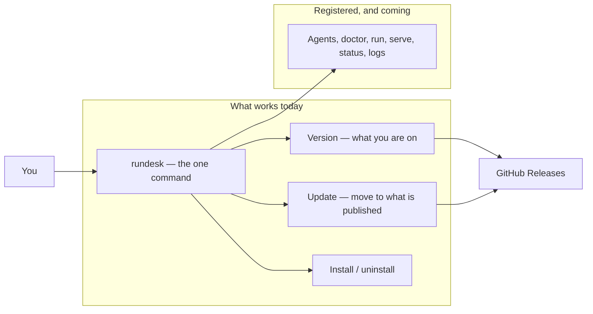

# Overview — rundesk-cli

*The platform in plain language — written for product, marketing and anyone new, not for developers. What
the parts are and how something moves through them. Follow a link to learn what a part guarantees.*

*This describes the platform as designed. What is proven today is recorded row by row in the contracts —
[`prd/`](./prd/) for the ratified ones, [`prd-drafts/`](./prd-drafts/) for those still in proposal.*

## What this is

`rundesk` is the command a person uses to run a small team of AI assistants on their own computer and
reach them from a chat app. This is its Python rewrite, and today it does the part that comes before
everything else: putting itself on your machine, telling you which version you are on, moving you to a
newer one, and taking itself off again. It is a self-hosted tool, not something sold; there is no revenue
model.

## The platform

## How it works

- **rundesk** — the one command, and the whole surface. Every verb the finished product will have is
  listed from the start, so what is coming is never a surprise.
- **Version** — which release this install is, and whether a newer one exists.
- **Update** — fetches the newest published release and lays it over the install, leaving the command on
  your PATH working.
- **Install / uninstall** — puts the command on your PATH, or removes it. It refuses to report success
  until the command it installed actually answers.
- **Agents, doctor, run, serve, status, logs** — the gateway itself. Registered and answering "coming
  soon" until each is built.
- **GitHub Releases** — where a published version comes from.

## What you use

- **The owner** — installs the command, checks what version they are on, and updates when there is a
  newer one. Nobody else touches this: it runs on one person's machine, for that person.

## What governs it

- **Nothing to install first** — the standard library is the whole toolbox, so a machine with `python3`
  has everything. A dependency would be a user lost at the first step.
- **A command never claims a success it did not earn** — a verb that is planned and not built says so and
  exits non-zero, because a script reading `0` would believe the work happened.
- **"Could not ask" is never reported as "up to date"** — the one answer that would leave someone on an
  old version believing they are current.

---
*Editing this file? Follow the standard first: [`guides/docs-overview.md`](./guides/docs-overview.md).*
