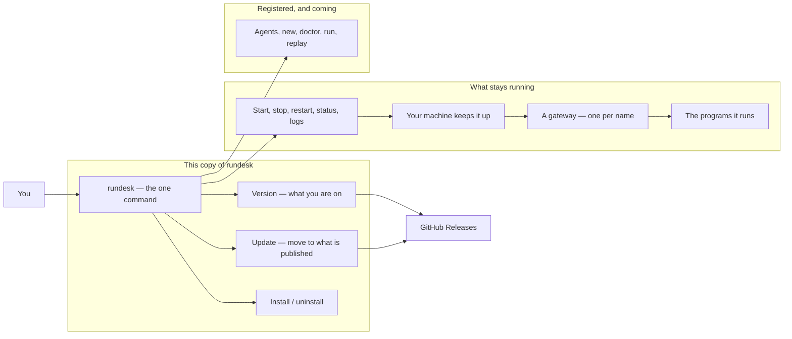

# Overview — rundesk-cli

*The platform in plain language — written for product, marketing and anyone new, not for developers. What
the parts are and how something moves through them. Follow a link to learn what a part guarantees.*

*This describes the platform as designed. What is proven today is recorded row by row in the contracts —
[`prd/`](./prd/) for the ratified ones, [`prd-drafts/`](./prd-drafts/) for those still in proposal.*

## What this is

`rundesk` is the command a person uses to run a small team of AI assistants on their own computer and
reach them from a chat app. This is its Python rewrite. Today it does the two parts that come before
everything else: putting itself on your machine and keeping itself current, and running the long-lived
process the assistants will work inside — starting it, keeping it up, telling you what it is doing, and
ending everything it started when it goes. The assistants themselves are not here yet. It is a
self-hosted tool, not something sold; there is no revenue model.

## The platform

## How it works

- **rundesk** — the one command, and the whole surface. Every verb the finished product will have is
  listed from the start, so what is coming is never a surprise.
- **Version** — which release this install is, and whether a newer one exists.
- **Update** — fetches the newest published release and lays it over the install, leaving the command on
  your PATH working.
- **Install / uninstall** — puts the command on your PATH, or removes it. It refuses to report success
  until the command it installed actually answers.
- **A gateway** — the part that stays running. There is one for each name, so later there can be one for
  each assistant, and any one of them can be restarted without disturbing the rest.
- **Your machine keeps it up** — rundesk supervises nothing itself. It writes down what to run and hands
  that to the thing your computer already has for keeping programs running, which brings a gateway back
  if it falls over and starts it again after a restart.
- **The programs a gateway runs** — later, the assistants' own tools. A gateway owns everything it starts:
  it ends all of it when it goes, never runs the same piece of work twice at once, and ends work an
  earlier gateway left behind.
- **Status and logs** — what is running, what each one is working on, and what it has been saying. A
  gateway that is up but stuck is shown as stuck, which the machine on its own cannot tell you.
- **Agents, new, doctor, run, replay** — the assistants themselves. Registered and answering "coming soon"
  until each is built.
- **GitHub Releases** — where a published version comes from.

## What you use

- **The owner** — installs the command, checks what version they are on, and updates when there is a
  newer one. Nobody else touches this: it runs on one person's machine, for that person.

## What governs it

- **Nothing to install first** — the standard library is the whole toolbox, so a machine with `python3`
  has everything. A dependency would be a user lost at the first step.
- **A command never claims a success it did not earn** — a verb that is planned and not built says so and
  exits non-zero, because a script reading `0` would believe the work happened.
- **"Could not ask" is never reported as "up to date"** — the one answer that would leave someone on an
  old version believing they are current.
- **Nothing is left running that nobody owns** — everything rundesk starts belongs to something, and when
  that something goes, what it started goes too. A gateway that is killed outright leaves work behind, and
  the next one of that name ends it.
- **Nothing runs twice** — one gateway of each name, and one of each piece of work inside it.
- **Long work is left alone; stuck work is not** — a session may take hours, so nothing is ended for taking
  its time. What is ended is a program that has gone silent, or one still going long past when any real
  work would have finished.
- **What happened is written down** — every gateway keeps its own log, and it outlives the gateway, so
  something that went wrong overnight can still be explained in the morning.

---
*Editing this file? Follow the standard first: [`guides/docs-overview.md`](./guides/docs-overview.md).*
