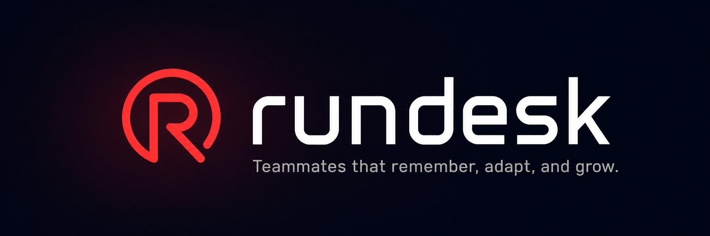
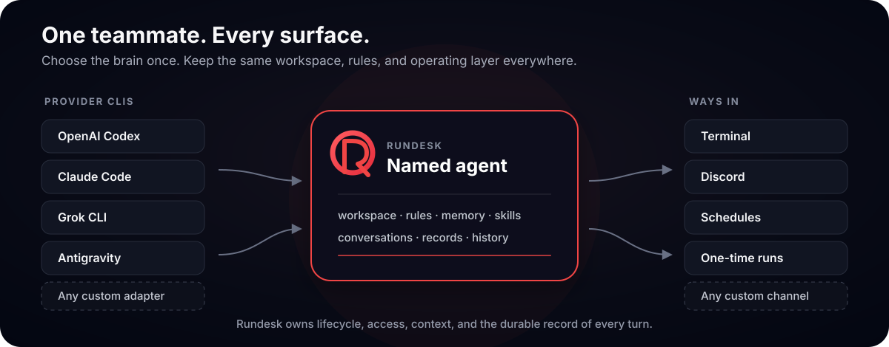
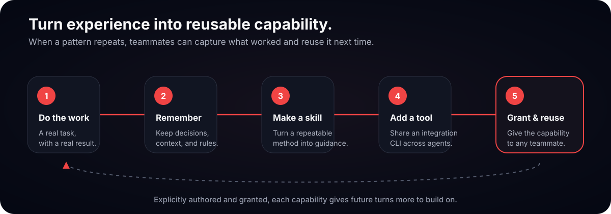

<h1 align="center">
  
</h1>

<p align="center">
  <a href="https://github.com/rundesk-ai/rundesk-cli/actions/workflows/build.yml?query=branch%3Amain"></a>
  <a href="https://github.com/rundesk-ai/rundesk-cli/releases/latest"></a>
  
  
  
</p>
<p align="center">
  ✨ <a href="#-highlights"><strong>Highlights</strong></a>
  &nbsp;·&nbsp;
  🚀 <a href="#-quick-start"><strong>Quick start</strong></a>
  &nbsp;·&nbsp;
  🧠 <a href="#-provider-adapters"><strong>Providers</strong></a>
  &nbsp;·&nbsp;
  💬 <a href="#-channel-adapters"><strong>Channels</strong></a>
  &nbsp;·&nbsp;
  📖 <a href="#-documentation"><strong>Docs</strong></a>
</p>

**Run AI coding agents as durable, named teammates on your own Mac — then reach them from
your terminal, Discord, or a schedule.**

Rundesk keeps the coding CLI you already use running with its own workspace, rules, memory,
skills, conversations, and history. It does not replace Codex, Claude Code, Grok, or Google
Antigravity; it gives those tools a dependable home and a common operating layer.

<p align="center">
  
</p>

## ⚡ It's this simple

```sh
rundesk add ava --provider codex
rundesk ask ava "review this repository and tell me the highest-risk open issue"
```

That creates a working agent and starts a continuing conversation. Keep it available after
the terminal closes:

```sh
rundesk start ava
```

Or put the same agent on Discord:

```sh
rundesk channels ava add discord --kind discord --allow <your-discord-user-id>
```

## ✨ Highlights

- **Bring your own coding agent.** Use the shipped Codex, Claude Code, Grok, or Google
  Antigravity adapter, or point Rundesk at a provider adapter you wrote.
- **One identity, one home.** Every agent has its own workspace, rules, memory, skills,
  conversations, and logs.
- **Always available.** macOS `launchd` keeps each agent's gateway running and brings it
  back after a crash or reboot.
- **Terminal, chat, and scheduled work.** Continue the same agent from the command line,
  Discord, recurring cron schedules, or one-time scheduled turns.
- **A durable account of every turn.** Inspect messages, tool activity, outcomes, and
  token usage without relying on a provider's private session format.
- **Reusable capabilities.** Grant agents on-demand skills and place shared integration
  CLIs on every agent's `PATH`.
- **Self-improving by design.** Agents can turn repeated work into reusable skills and
  integration CLIs, so a capability developed once can be granted to every agent.
- **Local and recoverable.** Rundesk keeps its program separate from your data, supports
  manual and daily backups, and never requires a hosted Rundesk server.

<p align="center">
  
</p>

## 💡 Why Rundesk?

Coding agents are excellent at a turn of work, but their native home is usually one terminal
session. Rundesk adds the parts needed to operate them over time:

- a stable identity and workspace for each agent;
- an always-on gateway owned by the operating system;
- continuing conversations and a durable history of terminal, chat, and scheduled work;
- schedules that run once, never overlap, and do not run late after downtime;
- access controls for chat channels;
- normalized history and usage across different provider CLIs; and
- updates, backups, diagnostics, and removal with explicit ownership boundaries.

The provider and channel seams are programs, not in-process plugins. A custom adapter can be
written in any language and receives the same scheduling, lifecycle, history, and channel
behavior as a shipped adapter.

## 🚀 Quick start

### Requirements

- macOS
- Python 3.9 or newer
- At least one [supported provider CLI](#-provider-adapters), installed and signed in

### Install

```sh
curl -fsSL https://github.com/rundesk-ai/rundesk-cli/releases/latest/download/install.sh | bash
```

Rundesk installs under `~/.rundesk` without editing your shell profile:

```text
~/.rundesk/
  app/          the installed Rundesk release
  data/         your agents, skills, scripts, history, and configuration
```

Updates replace `app/`; uninstall leaves `data/` alone unless you explicitly ask to purge it.
When an update needs to migrate agent records, Rundesk first stops every gateway and keeps a
rollback copy of each database. If any migration fails, it restores every agent's records and
keeps the previous release in place.

### Create and check an agent

```sh
rundesk add ava --provider codex
rundesk doctor ava
rundesk ask ava "summarize what changed in this repository today"
```

Answers stream to the terminal. The next `ask` resumes the same terminal conversation; use
`--fresh` to start again, `--read-only` for a constrained turn, or `--steer` with Codex to
add instructions while a turn is running.

### Keep it running

```sh
rundesk start ava
rundesk agents
rundesk logs ava
```

Each agent has its own gateway. Restarting or stopping one does not disturb the others, and
stopping a gateway ends the provider and every child process it started.

### Schedule work

Run a recurring turn:

```sh
rundesk schedules ava add nightly \
  --when "0 3 * * *" \
  --ask "review today's changes and report anything risky"
```

Run once and post the outcome to an existing channel:

```sh
rundesk schedules ava add release-check \
  --at "2026-07-29T09:00" \
  --ask "verify the release and summarize the result" \
  --to discord-dms
```

Schedules can start an agent turn or an executable by full path. Rundesk records the
outcome either way.

## 🧠 Provider adapters

Rundesk ships four first-class provider adapters. Each uses the provider CLI and login
already established on your machine; Rundesk does not copy provider credentials.

| Provider CLI | `--provider` | First-class support |
|---|---|---|
| [OpenAI Codex CLI](https://learn.chatgpt.com/docs/codex/cli) | `codex` | Continuing conversations, model selection, tool activity, per-turn usage, and live steering |
| [Anthropic Claude Code](https://code.claude.com/docs/en/overview) | `claude` | Continuing conversations, model selection, tool activity, and per-turn usage |
| [xAI Grok CLI](https://docs.x.ai/build/cli/headless-scripting) | `grok` | Continuing conversations, model selection, tool activity, and per-turn usage |
| [Google Antigravity CLI](https://antigravity.google/docs/cli/install) | `antigravity` | Continuing conversations, model selection, tool activity, and per-turn usage |

Switch the default provider when creating an agent:

```sh
rundesk add claude-agent --provider claude
rundesk add grok-agent --provider grok
rundesk add antigravity-agent --provider antigravity
```

Or choose a different provider or model for one turn or schedule without changing the
agent's default.

### Custom providers are first-class

```sh
rundesk add ava --provider /opt/my-provider --model fast-1 --set effort=high
```

A provider adapter is an executable that exchanges newline-delimited JSON records with
Rundesk. It can be a Python program, compiled binary, or shell script. Custom providers use
the same agent homes, schedules, channels, turn records, usage reporting, and lifecycle as
the adapters above.

→ **[Write a provider adapter](src/templates/skills/building-a-provider-adapter/references/the-contract.md)**

## 💬 Channel adapters

### Discord

Discord is the shipped first-class channel adapter:

```sh
rundesk channels ava add discord --kind discord --allow <your-discord-user-id>
```

The command securely asks for the bot token when needed, proves the connection before
saving anything, and creates separate `discord-dms` and `discord-rooms` channels by default.
You can also narrow it to direct messages, one server, or one channel.

On Discord, Rundesk supports:

- direct messages and server rooms;
- a dedicated thread when the agent is mentioned in a room;
- explicit per-channel user allowlists;
- typing, state reactions, and optional live activity;
- long answers and generated files as attachments;
- inbound message attachments; and
- stopping or forgetting a conversation from chat.

```sh
rundesk channels ava instructions discord-rooms \
  "You are {agent} in {where.channel}. Others can read this, so keep it concise."
```

Channel instructions keep public-room behavior separate from private conversations.

### Custom channels are first-class

Like a provider adapter, a channel adapter is an executable rather than code Rundesk loads.
It owns the vocabulary and behavior of its platform while Rundesk owns access control, turn
state, history, and delivery. A custom channel gets the same agent and turn lifecycle as
Discord without changing Rundesk core.

→ **[Write a channel adapter](src/templates/skills/building-a-channel-adapter/references/the-contract.md)**

## 🧰 Everything Rundesk supports

### Agents and gateways

- Named agents with isolated homes, workspaces, rules, memory, and skills
- Private provider homes when the provider supports one; native-keyring and machine-login
  providers keep their state under the provider's own rules
- Diagnostics before a broken agent becomes an unattended failure
- One independently managed gateway per agent
- Clean start, stop, restart, update, uninstall, and optional purge operations

### Conversations and records

- Continuing or fresh conversations from terminal, channel, or schedule
- Read-only and working postures, translated into each provider's native controls
- Messages, tool activity, outcomes, errors, and token usage recorded per turn
- Message filters and full-text search across an agent's conversations

### Schedules

- Standard five-field cron schedules
- One-time schedules at an exact local timestamp
- Agent turns or arbitrary executables by full path
- Per-schedule provider, model, instructions, and delivery channel
- No overlapping run of the same schedule and no late execution after downtime

### Skills and integration CLIs

- A shared skill library with per-agent grants
- Built-in skills that update with Rundesk and owner-created skills that do not
- A shared executable library placed on every agent's `PATH`
- Companion guidance for building guarded, offline-tested service integrations

### Operations and data

- Install, version check, self-update, status, and doctor commands
- Manual backups, automatic daily backups, restore, and configurable backup location
- Program and owner data kept in separate directories
- Agent removal that preserves its home unless purge is explicitly requested
- Generated command reference that cannot drift from the installed parser

## 📖 Documentation

- **[CLI reference](CLI.md)** — every command and argument, generated from the parser
- **[Provider adapter contract](src/templates/skills/building-a-provider-adapter/references/the-contract.md)** — put another coding CLI behind an agent
- **[Channel adapter contract](src/templates/skills/building-a-channel-adapter/references/the-contract.md)** — reach an agent from another platform
- **[Integration CLI guide](src/templates/skills/building-integration-clis/SKILL.md)** — give every agent a custom command
- **[Tested contracts](.knowledge/prd/README.md)** — every guarantee and the test that proves it
- **[Roadmap](ROADMAP.md)** — what is built, what is next, and why
- **[Architecture](.knowledge/CODEMAP.md)** — how the system is organized

## 🧪 Tests

The test suite is offline: it does not start a real provider or reach the network.

```sh
python3 .knowledge/scripts/gate
```

The gate discovers every suite, checks the documentation evidence, validates the shell
surface, and performs a real install and uninstall.

## License

Rundesk is available under the [MIT License](LICENSE).
