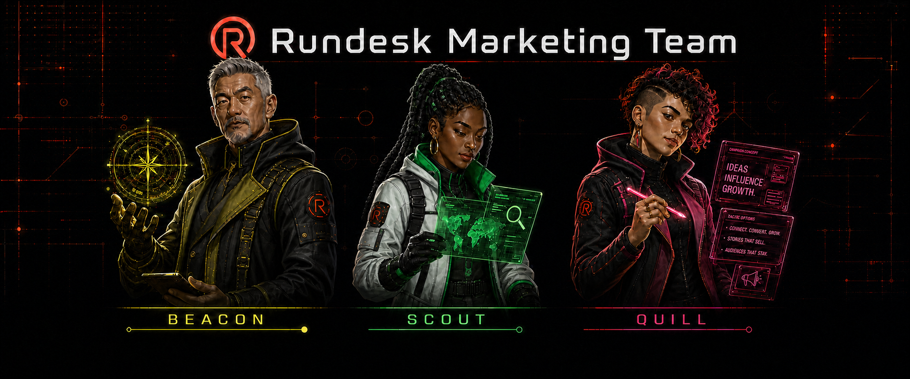

<h1 align="center">
  
</h1>

<p align="center">
  <a href="https://github.com/rundesk-ai/rundesk-cli/actions/workflows/build.yml?query=branch%3Amain"></a>
  <a href="https://github.com/rundesk-ai/rundesk-cli/releases/latest"></a>
  <a href="LICENSE"></a>
</p>

<p align="center">
  <a href="#-highlights"><strong>✨ Highlights</strong></a>
  &nbsp;·&nbsp;
  <a href="#-quick-start"><strong>🚀 Quick start</strong></a>
  &nbsp;·&nbsp;
  <a href="#-teams-and-skills"><strong>👥 Teams</strong></a>
  &nbsp;·&nbsp;
  <a href="#-provider-adapters"><strong>🧠 Providers</strong></a>
  &nbsp;·&nbsp;
  <a href="#-discord"><strong>💬 Discord</strong></a>
  &nbsp;·&nbsp;
  <a href="#-slack"><strong>💬 Slack</strong></a>
  &nbsp;·&nbsp;
  <a href="#-documentation"><strong>📖 Docs</strong></a>
</p>

Rundesk turns the coding agents you already use into durable teammates. Each agent gets a name,
home, memory, skills, and a gateway that keeps it available after the terminal closes. Rundesk runs
locally on macOS with Codex, Claude Code, Grok, or Antigravity.

## ✨ Highlights

- **Work from anywhere.** Continue one conversation from the terminal, Discord, or Slack.
- **Keep agents available.** macOS `launchd` brings each gateway back after a crash, reboot, or
  update.
- **Schedule work.** Run recurring or one-time tasks and deliver results through the agent's
  notification channel.
- **Build a real team.** Install versioned specialists with shared skills and canonical
  instructions.
- **Keep control.** Rundesk has no hosted server or product telemetry. Your agents and records stay
  under your local Rundesk home.

## 🚀 Quick start

**Requires macOS · Python 3.9+ · one [supported coding CLI](#-provider-adapters) installed and
signed in**

```sh
curl -fsSL https://get.rundesk.ai/rundesk | bash
rundesk agents add ava --provider codex
rundesk ask ava "summarize what changed in this repository today"
```

Step by step, with what to check after each: [Set up your first agent](docs/guides/getting-started.md).

The next `ask` continues the same conversation. Keep the agent available after the terminal closes:

```sh
rundesk gateways start ava
```

Add Discord with the [step-by-step setup guide](docs/guides/discord.md) when you want to reach the agent
away from your terminal, or schedule work for later:

```sh
rundesk schedules add ava daily --when "0 4 * * *" --ask "review today's changes"
```

## 👥 Teams and skills

A team catalog packages named specialists, canonical instructions, and the skills they use. Install
the whole team or use its skills on their own.

### Development Team

<a href="https://github.com/rundesk-ai/rundesk-team-development">
  
</a>

[View the Development Team repository](https://github.com/rundesk-ai/rundesk-team-development).

### Marketing Team

<a href="https://github.com/rundesk-ai/rundesk-team-marketing">
  
</a>

[View the Marketing Team repository](https://github.com/rundesk-ai/rundesk-team-marketing).

Beacon maps external growth opportunities, Scout researches markets and competitors, Signal
analyzes first-party growth data, and Quill produces messaging and content from an approved brief.

### Install a team

Choose a repository above, then preview and confirm the installation. For example, to install the
Development Team:

```sh
rundesk teams install https://github.com/rundesk-ai/rundesk-team-development --provider codex
rundesk teams install https://github.com/rundesk-ai/rundesk-team-development --provider codex --confirm
```

Team members are created with their gateways stopped. Start only the agents you want to use:

```sh
rundesk gateways start forge
```

You can install the same repository as a skills-only catalog without creating agents:

```sh
rundesk skills install https://github.com/rundesk-ai/rundesk-team-development
rundesk skills install https://github.com/rundesk-ai/rundesk-team-development --confirm
rundesk skills grant ava rundesk-team-development/managing-development-work
```

Installing the team later keeps the existing catalog and adds the managed agents. See
[Install or build a team](docs/extending/catalogs.md#building-a-team-catalog) for the complete `team.json`
example, local preview workflow, and publication contract.

#### Supported first-party catalogs

- [`rundesk-skills`](https://github.com/rundesk-ai/rundesk-skills) — engineering, research, design,
  planning, and operating guidance; installed by default.
- [`rundesk-skills-apple`](https://github.com/rundesk-ai/rundesk-skills-apple) — guarded Calendar,
  Contacts, Mail, and Messages integrations for macOS.
- [`rundesk-skills-integrations`](https://github.com/rundesk-ai/rundesk-skills-integrations) —
  guarded service integrations for Cloudflare, Atlassian, Coolify, Discord, Monarch Money, Sentry,
  Slack, and Stripe.
- [`rundesk-skills-google`](https://github.com/rundesk-ai/rundesk-skills-google) — Search Console,
  Analytics, PageSpeed Insights, and Merchant Center integrations.
- [`rundesk-skills-gamedev`](https://github.com/rundesk-ai/rundesk-skills-gamedev) — game design,
  production, art, simulation, Axmol, and C++ guidance.
- [`desk-cli`](https://github.com/rundesk-ai/desk-cli) — task, desk, project, page, mention, and asset
  workflows for Desk.

The skills under this repository's `src/skills/` ship with Rundesk as the reserved `rundesk`
catalog. They are first-party operating skills replaced from the CLI on every install and update.

## 🧠 Provider adapters

Rundesk uses the provider CLI and login already on your machine; it does not copy provider
credentials. `rundesk providers` lists what the current install can run.

| Provider CLI | `--provider` | Notes |
|---|---|---|
| [OpenAI Codex CLI](https://learn.chatgpt.com/docs/codex/cli) | `codex` | Supports live steering |
| [Anthropic Claude Code](https://code.claude.com/docs/en/overview) | `claude` | — |
| [xAI Grok CLI](https://docs.x.ai/build/cli/headless-scripting) | `grok` | — |
| [Google Antigravity CLI](https://antigravity.google/docs/cli/install) | `antigravity` | Cannot be steered mid-turn |

Choose a provider when creating an agent or change its default later:

```sh
rundesk agents add claude-agent --provider claude
rundesk agents configure ava --provider claude
```

Changing the provider keeps the agent's identity, home, memory, conversations, channels, schedules,
and history. Active work finishes with the provider it started with.

Models and read-only posture can be selected per turn:

```sh
rundesk ask ava --model opus "review this"
rundesk ask ava --read-only "what changed today?"
```

Custom providers are executable adapters that exchange newline-delimited JSON records with
Rundesk. See the [provider adapter contract](docs/extending/providers.md).

## 💬 Discord

Discord is the included channel adapter. One bot connection per agent supports direct messages,
server channels, dedicated threads, allowlisted access, attachments, activity updates, and agent
commands from chat.

To connect an agent, create a bot in the
[Discord Developer Portal](https://discord.com/developers/applications), enable **Message Content
Intent**, and copy your numeric Discord user ID. Then run:

```sh
discord_user_id=123456789012345678
rundesk channels add ava discord --allow "$discord_user_id" --notify
rundesk gateways start ava
```

Rundesk prompts for the token without echoing it and verifies the connection before saving the
channel. Use one Discord application per agent so each has its own identity. `--notify` makes this
the channel for gateway notices, scheduled results, and other unprompted messages. Discord sends
each one privately to every user named by `--allow`; direct replies remain in the conversation that
asked.

The [full Discord setup guide](docs/guides/discord.md) walks through the Developer Portal, least-privilege
permissions, installation, and troubleshooting step by step.

If the bot does not answer, check the channel and gateway directly:

```sh
rundesk channels doctor ava
rundesk gateways logs ava
```

## 💬 Slack

Slack is the second included channel adapter. One Slack app per agent, over Socket Mode, with no
public URL and no port to open. It answers every direct message and, in a channel it was invited to,
only a message that names it — including inside somebody else's thread, where it replies in that
thread and reads a bounded slice of it. Several agent bots can share one thread and each wakes only
when it is named.

**It is deliberately quiet.** The final answer is the only thing it posts into a conversation: no
running commentary, no tool or activity lines, no delegation notices, no token counts, and no
footer. A turn shows as 👀 on the message that asked, Slack's own agent-session typing status while
it works, and ✅ when the answer has gone out. The agent is told how to mention whoever spoke to
it, and only for that. An answer can name one person with Slack's own
`<@U…>` markup and can never address a room: `@channel`, `@here`, `@everyone`, a user group, and a
channel link all arrive as the text they look like.

**It offers one slash command, named after the agent** — `/ava status`, `/ava schedules`,
`/ava provider codex` — because a Slack command name belongs to the whole workspace rather than to
one app. Every answer to it is private to whoever typed it, and none of them starts a turn.

**A file the agent attached goes with the answer**, verified again immediately before it is uploaded
and shared into the same conversation and thread. If one cannot go, the words are still posted and a
line under them says which file is missing. Nothing arriving is fetched; a file comes in only when the
agent asks for one message's files by name with `rundesk search --fetch`.

**A direct message is one conversation however you thread it**, so its history and its session stay
whole; the answer arrives in the thread you asked in, or in one rooted at your message. A thread in a
channel remains a conversation of its own.

Create an app from the manifest in the setup guide, **declare it as an agent in its app settings and
only then install it to the workspace** — that declaration adds a scope, and a scope added after a
token is issued does not reach it — copy the bot token (`xoxb-`) and an app-level token (`xapp-`,
scope `connections:write`), invite the bot to a channel, and then:

```sh
slack_member_id=U01ABCDEF2G
slack_channel_id=C01ABCDEF2G
rundesk channels add ava slack --allow "$slack_member_id" --allow "place:$slack_channel_id" --notify
rundesk gateways start ava
```

`--allow place:<channel id>` lets anybody in that Slack channel reach the agent; a bare id or
`sender:<member id>` allows one person wherever they say it. Rundesk decides who may be answered, not
the adapter. A Slack **user** token is refused by name, and no user-history or search scope is asked
for.

The [full Slack setup guide](docs/guides/slack.md) covers the app manifest, the ordered step that
declares the app an agent, the minimum bot scopes, what the typing indicator needs, running several
agents in one thread — where each reads what the other answered and never its own — and the
difference between a workspace installation and an Enterprise Grid organisation approval.

Custom channel adapters are executables too. Rundesk owns access control, turn state, history, and
delivery while the adapter owns its platform. See the [channel adapter contract](docs/extending/adapters.md).

## ❓ FAQ

<details>
<summary><strong>Does this replace Codex or Claude Code?</strong></summary>

No. Rundesk is the operating layer around the coding CLI you already use. The provider still owns
the model, context, caching, compaction, and tool execution.

</details>

<details>
<summary><strong>Won't a wrapper burn my tokens?</strong></summary>

Rundesk resumes the provider's native session. Skills use the provider's discovery mechanism
instead of being pasted into every prompt.

</details>

<details>
<summary><strong>Does my code leave my machine?</strong></summary>

Only wherever the provider CLI already sends it. Rundesk has no hosted server, account, or product
telemetry.

</details>

<details>
<summary><strong>Linux or Windows?</strong></summary>

Not yet. Rundesk currently uses macOS `launchd` to manage gateways.

</details>

<details>
<summary><strong>What happens when Rundesk updates?</strong></summary>

Updates replace the program under `~/.rundesk/app` while preserving the agent data under
`~/.rundesk/data`. Rundesk also checks installed catalogs and restores their declared files when
needed.

</details>

## 📖 Documentation

- **[Get started](docs/guides/getting-started.md)** — install, add an agent, keep it reachable
- **[Commands](docs/api/)** — every operation, what each guarantees, and the exit codes
- **[How it works](docs/concepts/)** — gateways, providers, channels, delegation, skills, lifecycle
- **[Extending it](docs/extending/)** — the channel, provider, and catalog contracts
- **[Guides](docs/guides/)** — first agent, running an install, teams, delegation, Discord, Slack
- **[All documentation](docs/README.md)** — the index, including requirements and research

## 🤝 Contributing

Start with the [contributing guide](CONTRIBUTING.md) and use `./dev` for checkout commands so your
live Rundesk install stays untouched.

```sh
python3 scripts/suites
```

- [Report a bug](https://github.com/rundesk-ai/rundesk-cli/issues/new?template=bug-report.md)
- [Propose a change](https://github.com/rundesk-ai/rundesk-cli/issues/new?template=change-proposal.md)
- [Open a pull request](.github/pull_request_template.md)

## 📄 License

Rundesk is available under the [MIT License](LICENSE).
