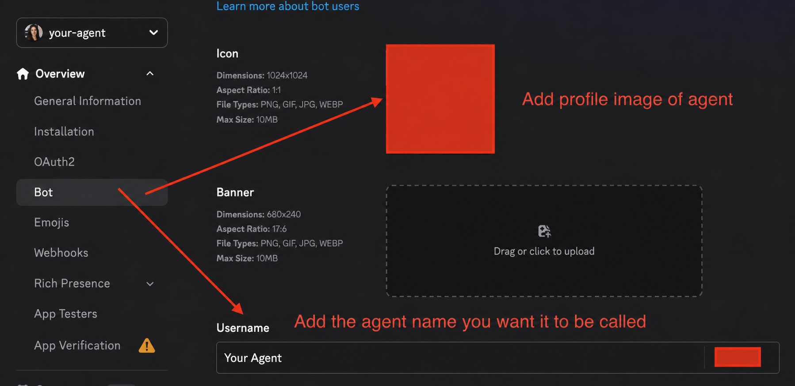
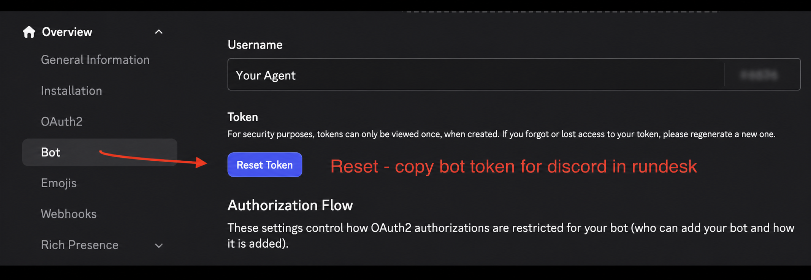
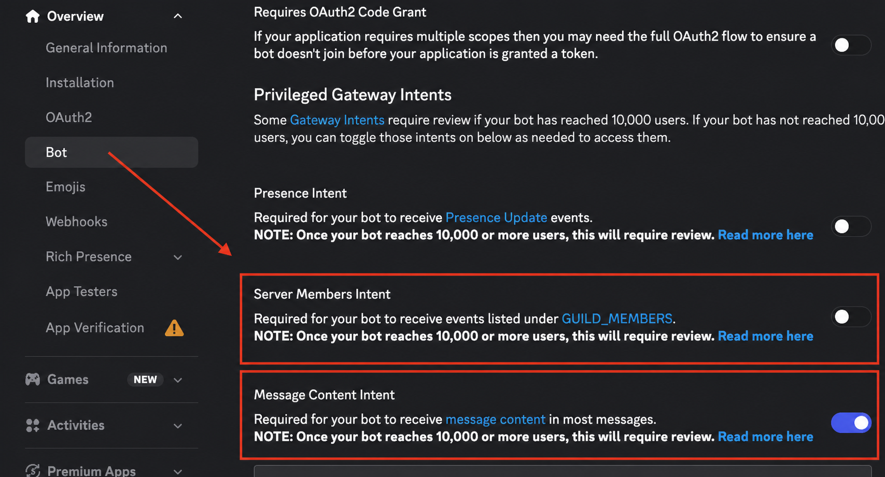
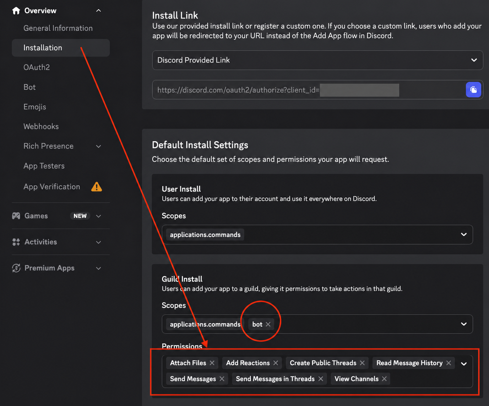
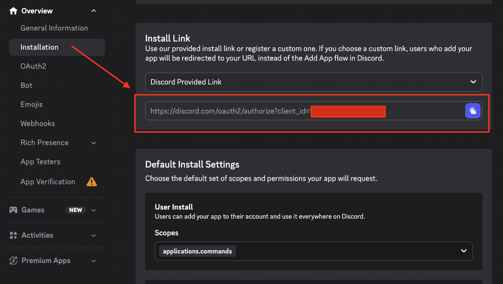

# Set up a Discord bot

Rundesk gives each agent its own Discord bot. The bot can answer direct messages, open a thread
when mentioned in a server channel, send files, show activity, and offer Rundesk slash commands.

You need:

- a Rundesk agent, such as `ava`;
- a Discord account;
- a server where you have permission to install apps; and
- your numeric Discord user ID.

The bot token is a password. Never paste it into a command, commit it, or send it in a message.
Rundesk prompts for it without echoing it and keeps it under that agent's own name.

## 1. Create the application

1. Open the [Discord Developer Portal](https://discord.com/developers/applications).
2. Select **New Application**, enter the name you want the agent to use, and select **Create**.
3. Open **Bot** in the sidebar.
4. Add the agent's username and profile image. These are the name and avatar people see in Discord.



*Give the bot the same name and profile image you want people to recognize as the agent.*

Use one Discord application per Rundesk agent. One bot is one identity; sharing a token between two
agents lets both receive and answer the same messages.

## 2. Copy the bot token

On the **Bot** page:

1. Select **Reset Token**.
2. Complete Discord's confirmation or two-factor prompt.
3. Copy the token and keep it in a password manager until Rundesk asks for it.



*Reset the token, copy it once, and keep it private until Rundesk prompts for it.*

Discord shows the token once. If it is lost or exposed, reset it before connecting the bot.

## 3. Enable Message Content Intent

Still on the **Bot** page, find **Privileged Gateway Intents** and enable:

- **Message Content Intent**

Leave **Presence Intent** and **Server Members Intent** off. Rundesk does not request them.



*Enable Message Content Intent only. Leave Presence Intent and Server Members Intent off.*

Without Message Content Intent, Discord hides ordinary server and thread messages from the bot.
Rundesk checks this setting and refuses the connection instead of saving a channel that cannot read
its conversations.

## 4. Configure the installation

Open **Installation** in the Developer Portal.

1. Under **Installation Contexts**, enable **Guild Install**.
2. Under **Install Link**, select **Discord Provided Link**.
3. Under **Default Install Settings** for Guild Install, add these scopes:
   - `bot`
   - `applications.commands`
4. Grant only these permissions:
   - **View Channels**
   - **Add Reactions**
   - **Send Messages**
   - **Attach Files**
   - **Read Message History**
   - **Create Public Threads**
   - **Send Messages in Threads**



*Guild Install needs the `bot` and `applications.commands` scopes plus the seven permissions shown.*

These permissions match what the shipped Discord adapter does. Rundesk does not need **Change
Nickname**, **Connect**, **Embed Links**, **Manage Channels**, **Manage Messages**, or **Manage
Threads**.

The install link is generated above the default settings. You can use it now, but Rundesk also
prints a verified invite after it connects in the next steps. A bot already installed in a server
must be authorized again if its scopes or permissions change.



*Copy the Discord-provided install link after saving the scopes and permissions.*

## 5. Copy your Discord user ID

In the Discord app:

1. Open **User Settings** → **Advanced**.
2. Enable **Developer Mode**.
3. Right-click your profile and select **Copy User ID**.

Use the numeric ID, not a username. Repeat `--allow` for each additional person who may reach the
agent.

## 6. Connect the bot to the agent

Run:

```sh
discord_user_id=123456789012345678
rundesk channels add ava discord --allow "$discord_user_id" --notify
```

Replace `ava` with the agent's name and the example ID with your own. Rundesk asks for the bot token
without echoing it, connects to Discord, verifies Message Content Intent, and only then saves the
channel.

Use `--notify` for the first channel you add. `--allow` controls who may reach the agent and who
receives private gateway notices, schedule results, and returned delegated work. `--notify` selects
Discord as the adapter for those unsolicited messages. Direct replies still go only to the DM,
room, or thread that asked.

On success, save the printed **invite** URL and open it to add the bot to a server. The URL already
contains Rundesk's required scopes and permissions. The bot is not in a server until someone with
permission authorizes it there.

## 7. Start and test the gateway

`channels add` proves the connection and then exits. Start the agent's persistent gateway:

```sh
rundesk gateways start ava
```

Then test the surfaces you enabled:

- Send the bot a direct message.
- The agent is told how to mention whoever spoke to it, and only for that, so an answer can
  address the person it is answering.
- Mention the bot in a server channel. It opens a thread; later messages in that thread do not need
  another mention.
- Run `/status` to confirm the slash commands are available.

If the bot answers but never speaks first, mark the channel for notifications and restart:

```sh
rundesk channels configure ava discord --notify
rundesk gateways restart ava
```

## What it can search

`rundesk search` lets the agent look through the servers this bot is in, mid-turn, and ask again once
it has read the answer. It is the same verb on every platform — see
[the command](../api/conversations.md#search) — and this section is only what *Discord* does behind
it.

```console
$ rundesk search ava "the parser rewrite" --since 2026-08-01
3 found on discord, holding 'the parser rewrite', since 2026-08-01  (6 places looked through)
WHEN                  WHO   WHERE                     FILES  REF                       SAID
2026-08-30T14:02:11Z  Dana  the ops room in Acme      1      1180…/1234…               the parser rewrite landed
```

**Nothing new has to be set up for this.** Discord publishes a message-search endpoint for bots, and
it needs `READ_MESSAGE_HISTORY` and the Message Content Intent — both of which this bot already has,
because [step 3](#3-enable-message-content-intent) and the invite in
[step 4](#4-configure-the-installation) already ask for them. There is no new scope, no new
permission, and no reason to send the invite again.

### Where it looks, and where it cannot

| | |
|---|---|
| channels in a server, where the bot may read history | **yes**, through Discord's own search |
| threads in those channels | **yes** |
| direct messages with the bot | **yes**, but read page by page rather than searched |
| group direct messages the bot is in | **yes**, the same way |
| channels the bot cannot view | **no** |
| your own direct messages with other people | **no** |

**Said plainly:** this searches what the *bot* can see, not what *you* can see. Discord has no
supported way for an application to see anything else — a user token is a self-bot, which its
developer terms do not permit — so this limit is not one a setting can lift.

**Servers are searched and direct messages are paged, and the two behave differently.** Discord's
search endpoint covers a server; there is no equivalent for a direct conversation, so those are read
back a page at a time and matched here. A direct conversation therefore costs more and is bounded
more tightly, and the agent is told when one could not be read rather than being left to read that
as an empty conversation.

### What it says when it could not look everywhere

**A search that stopped early always says so**, and never prints as an empty result.

| You will see it say | Because |
|---|---|
| it used a default window of the last 30 days | you gave no `--since`, and it will not read all of history by default |
| a server is still building its index | Discord answers a search on a newly-indexed server with a "try again later" of its own. **This is not an empty server** — ask again shortly |
| it stopped after so many servers, or so many pages | the search reached its own ceiling. Narrow it with `--place` or a shorter window |
| a direct conversation could not be read | it says which, rather than reporting nothing was said there |
| Discord rate-limited it | it stops rather than waiting one out. Waiting would spend a turn, and hammering through a rate limit is how a machine's own address earns a temporary ban |

**Every search is targeted and bounded.** Nothing runs in the background, nothing walks history
without a limit, and nothing is kept — which is what keeps this inside Discord's developer policy on
collecting message data.

### Bringing a file in

A result's `REF` is what `--fetch` takes:

```console
$ rundesk search ava --fetch '1180…/1234…' --channel discord
1 from 1180…/1234…, in ava's discord record
```

**The message is fetched again before anything is downloaded.** Discord signs attachment links with
an expiry and publishes no endpoint that refreshes one, so a link carried over from a search result
is already going stale — the fresh link comes from asking for the message again. Up to ten files of
32 MiB each, and a file whose size does not match what Discord declared is refused while the rest
still come.

## Troubleshooting

Run the channel diagnosis first:

```sh
rundesk channels doctor ava
rundesk gateways logs ava
```

### The bot is online but ignores messages

Enable **Message Content Intent** on the application's **Bot** page, then restart the gateway. In a
server channel, mention the bot in the first message so it can open the conversation thread.

### Slash commands do not appear

Authorize the bot with the `applications.commands` scope. If the bot was already installed, open
the invite printed by `channels add` and authorize it again.

### A search finds nothing that is plainly there

The bot was not invited to that channel, or cannot read its history. A search sees what the bot sees,
never what you see. `rundesk search ava <words> --place <channel id>` on a channel it can read is the
quickest way to tell the two apart.

### A search says a server is still indexing

Discord builds a search index per server and answers with a "try again later" until it is ready. That
is not an empty server and not a failure — ask again shortly.

### The bot cannot answer in one channel

Check that channel's role overrides for **View Channels**, **Send Messages**, **Create Public
Threads**, **Send Messages in Threads**, and **Read Message History**. Grant **Attach Files** and
**Add Reactions** for the complete Rundesk experience.

### The token was lost or exposed

Reset it on the application's **Bot** page, remove and reconnect the channel through Rundesk, and
never put the replacement token in shell history or a message.
